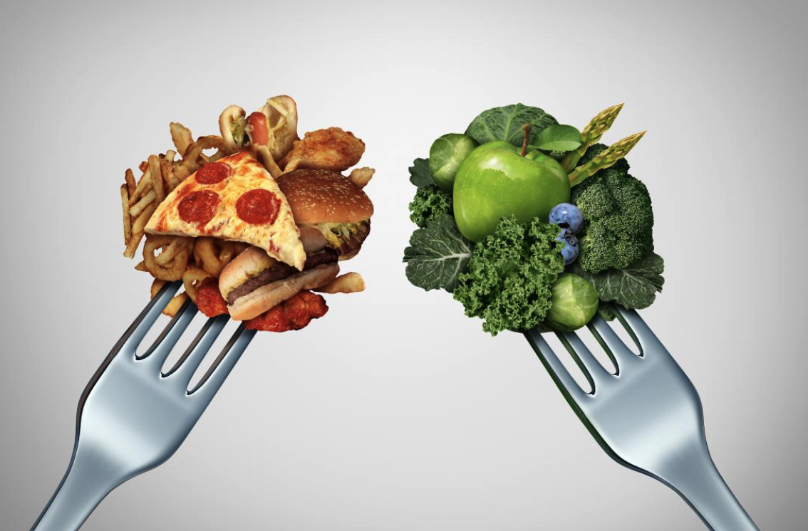

# Calo-Predictor: Recipe Calorie Estimation using Fat and Sugar Content"

Name(s): Jade Zhou / Zeyang Yu

---

  

## Framing the problem

In this project,We aim to predict the calorie content of each recipe, which is a regression problem. The response variable we are predicting is "calorie", chosen because it is an essential aspect of the nutritional value of a recipe. Understanding calorie content helps users make informed decisions about the meals they prepare or consume, as it allows them to manage their daily calorie intake and maintain a balanced diet.

The features we include in the model are "fat" and "sugar", as these are the variables that typically have the most significant influence on calorie content. Moreover, these two variables are readily available when the recipe is published, making them practical choices for predicting the calorie content.We chose R-squared over other regression metrics like Mean Absolute Error (MSE) because it is easy for us to seea a clear standardized measure and allows us to understand the proportion of variance explained by the model, which is useful for comparing different models.

##  Baseline Model:

We created two baseline models to predict the calorie content of recipes, one using a Decision Tree Regressor and the other using a Linear Regression model. After comparing their performances, we determined that the Linear Regression model better predicts our data.

The two features we use in our model are the amounts of fat and sugar in the recipes.Both of these features are quantitative, as they represent numerical values. There are no ordinal or nominal features in the baseline model.

By using the Decision Tree model, we obtained an R^2 score of 0.70. However, when using the Linear Regression model, the R^2 score increased to 0.79, which is clearly higher. Therefore, we chose the Linear Regression model as our preferred baseline model due to its better performance in explaining the variance in the calorie content based on the fat and sugar features.

##  Final Model:

We introduced two new features in the final model to enhance its performance: the sum of fat and sugar, and the absolute value of the difference between fat and sugar. After multiple tests, we found that fat and sugar have the closest relationship with calories, while other nutrition variables tend to lower the R^2 score. Thus, we decided to create new features based on fat and sugar, which allowed the model to capture more nuanced information that wasn't present in the original features. This increased understanding of the relationships between fat, sugar, and calories led to more accurate predictions.

Initially, we considered using a linear regression model for the final analysis. However, we faced challenges in finding an appropriate hyperparameter, so we opted for ridge regression instead. Ridge regression is similar to linear regression, but it includes a regularization term controlled by the hyperparameter alpha. By selecting an optimal alpha value, we can prevent overfitting and improve the accuracy of predictions on unseen data.

To determine the best alpha value for our ridge regression model, we employed GridSearchCV, with a potential alpha range from 1 to 10. The optimal alpha value was found to be 1. With the addition of the two new features and the optimal alpha, our final model achieved an R^2 score of 0.89. This represents a significant improvement of 0.1 compared to the linear regression baseline model, demonstrating the effectiveness of our feature and model selection choices in enhancing the model's performance.

To validate our choice of the Ridge Regression model, we calculated the R^2 score for a Decision Tree model using all four features and applied GridSearchCV to find the optimal tree depth. This alternative model had an R^2 score of 0.80, indicating that the two new features indeed improved the accuracy compared to the Decision Tree baseline model. However, the R^2 score of 0.80 was still lower than that of the final Ridge Regression model, confirming that Ridge Regression was a better fit for our dataset.

In conclusion, the final model predicts recipe calorie content using four features and employs Ridge Regression with an optimal alpha value of 1. The R^2 score for unseen data is 0.89, which is the highest score achieved through our manual iterative method. This demonstrates a clear improvement over the baseline model's performance.

## Fairness Analysis：
Our Group X is the recipes with **less than 10 ingredients** and our group y is the recipes with **10 or more ingredients**. Since our model is a regression model, we can't use classification metrics like precision or recall. Therefore, we will use **MSE** as our metric for this analysis.Our **null hypothesis** is the model is fair, with MSE for both Group X and Group Y being roughly the same and any differences arising due to random chance.On the other hand, the **alternative hypothesis** states that the model is unfair, with the MSE for Group X being different from the MSE for Group Y. **The Test Statistic** is the difference in MSE between two group. And we set our **significant level is 0.05**, and our **p-value is 0.0**.Therefore we **reject** the null hypothesis.1111111
